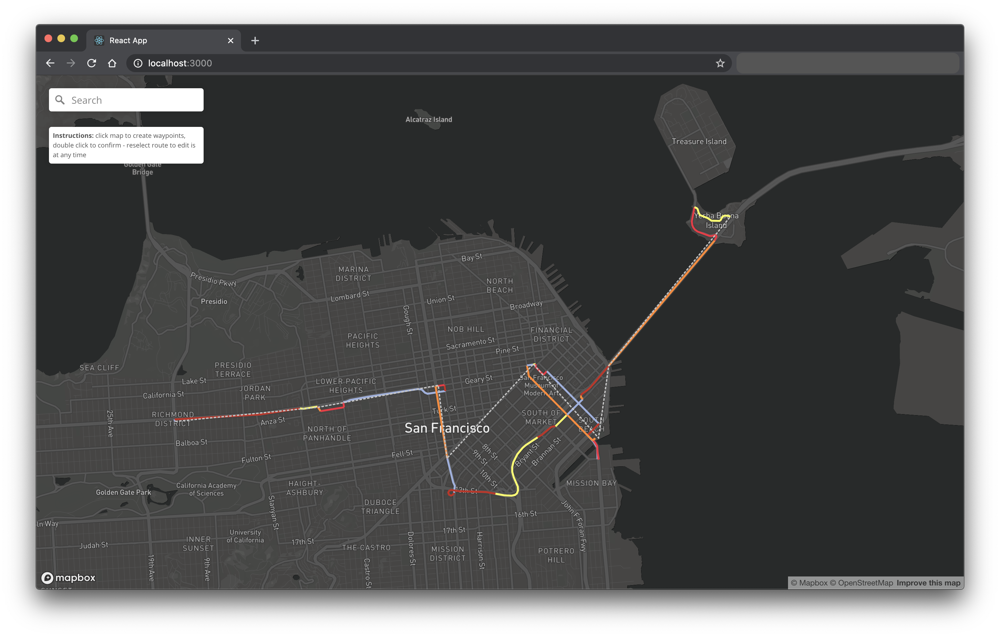

Weather Navigator
========

#### Weather Navigator using Tomorrow.io API ####
Use our [/route endpoint](https://docs.tomorrow.io/reference/route-overview) with Mapbox suite of solutions to visualize weather conditions along any route - on the fly.

### What's Included ###
Single page React app that allows users to draw a waypoint of a route anywhere in the world and see the `precipitationIntensity` road risk throughout the path - based on Tomorrow.io's >80 data points and Mapbox's [GLJS Map](https://docs.mapbox.com/mapbox-gl-js/api/), [Geocoding](https://docs.mapbox.com/api/search/geocoding/), [Navigation](https://docs.mapbox.com/api/navigation/directions).

> Note: This app uses the key on the clients-side React web app, but it is recommended to secure it by having a proxy backend service calling the Tomorrow.io API

### Usage ###
This project was bootstrapped with [Create React App](https://github.com/facebook/create-react-app) - head over to this amazing project to learn more on how to kickoff the work. To read the full project walkthrough, check out its [recipe on our documentation website](https://docs.tomorrow.io/recipes/minimize-road-risk-with-weather-along-a-route).

### Contributors ###
This project exists thanks to our engineers building the [Tomorrow.io Weather API](https://tomorrow.io).

### License ###
Licensed under the [MIT License](./LICENSE) license.
